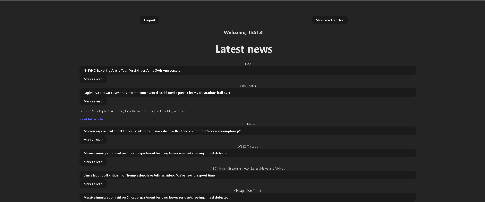
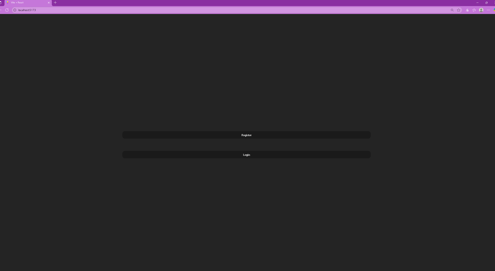
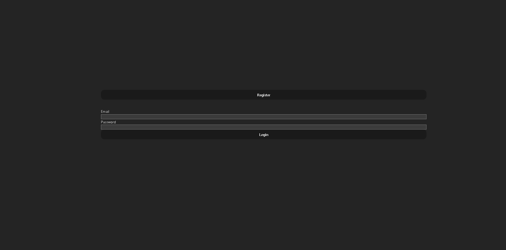
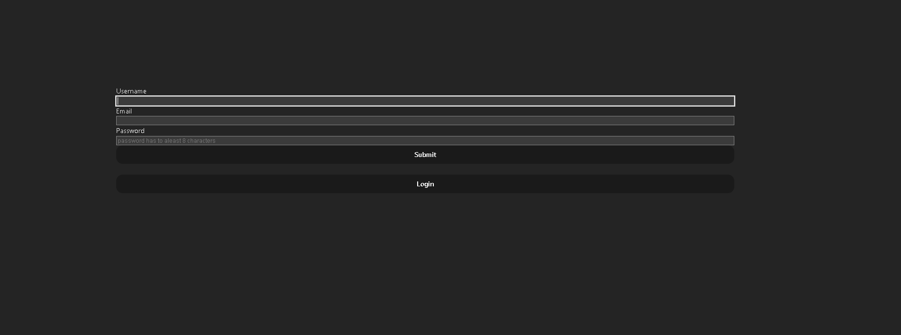

News Portal App

## 🚀 Live Preview => https://crud-news-app-project-vercel.vercel.app/

[](https://crud-news-app-project-vercel.vercel.app/)
[](https://crud-news-app-project-vercel.vercel.app/)
[](https://crud-news-app-project-vercel.vercel.app/)
[](https://crud-news-app-project-vercel.vercel.app/)

A responsive, animated news reader built with React, Tailwind CSS, and Framer Motion. Users can register, log in, and browse curated articles with smooth transitions, persistent read tracking, and accessibility-focused design.

Features
- User Authentication: Secure registration and login with JWT-based access tokens.
- Animated UI: Framer Motion powers smooth transitions between login/register states and article interactions.
- Persistent Read Tracking: Articles marked as read are hidden until reset, stored via localStorage.
- Responsive Design: Tailwind CSS ensures clean layout across devices.
- Accessibility: Keyboard-friendly forms, focus rings, and semantic HTML.
- Powered by Vercel’s serverless functions for scalable backend logic and fast deployment.

Installation
git clone https://github.com/mwenya-mwenya/crud-news-app-project-vercel.git
npm install
npm start

Usage
- Register or log in to access the news feed.
- Click headlines to expand summaries.
- Mark articles as read to hide them.
- Use “Show read articles” to reset visibility.
  
Folder Structure
<pre>```project-root/
├── .vercel/
├── api/
│   ├── auth/
│   │   ├── news.js
│   │   ├── login.js
│   │   └── register.js  
│   └── news.js
├── components/
│   ├── login.jsx
│   └── registration.jsx
├── dist/
├── src/
│   ├── assets/
│   │   └── react.svg
│   ├── App.css
│   ├── App.jsx
│   ├── index.css
│   └──  main.jsx
├── lib/
│   ├── config/
│   │   └── env.js
|   └── db/
│   │   └── connect.js
│   ├── middleware/
│   │   └── auth.js
│   ├── models/
│   │   ├── Article.js
│   │   └── User.js
│   ├── services/
│   │   └── newsService.js
│   └── validators/
│      ├── articles.js
│      ├── auth.js
│      └── error.js
├── public/
│   └── vite.svg
├── .gitignore
├── eslint.config.js
├── index.html
├── package-lock.json
├── package.json
├── postcss.config.js
├── README.md
├── sample.env
├── tailwind.config.js
├── vercel.json
└── vite.config.js```</pre>

Design Philosophy
This project emphasizes clarity, fairness, and user empowerment. It uses modular layout, animated transitions, and persistent state to create a polished experience that respects user intent.
